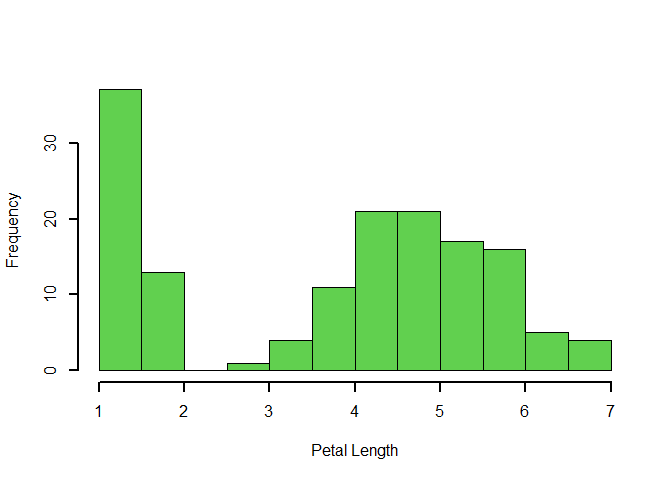

Programming Background
================

## Thoughts on R

### What are your thoughts on R vs whatever other software you’ve used?

R is a particularly good choice for frequent users that plan to deal
more extensively with statistics and don’t want to be restricted by
their statistical program R is a popular, open-source statistics
environment that can be extended by packages almost at will. R is
commonly used with RStudio, a comfortable development environment that
can be used locally or in a client-server installation via a web
browser. R applications can also be used directly and interactively on
the web via Shiny.  

### What functionality do you like about R?

1.Very large range of functions (well over 2,000 packages) 

2.New statistical methods are quickly implemented 

3.Very easy to automate and integrate (for example, with Git, LaTeX,
ODBC, Oracle R Enterprise, teradataR, Apache Hadoop, Microstrategy,
etc.) 

4.Very good community support, as well as fee-based support via
third-party providers 

5.Extensive help resources freely available (manuals, tutorials, and so
on) 

6.Very powerful and flexible scripting language (e.g. support of
object-oriented programming) 

7.All common platforms are supported (Windows, Linux, MacOS…) 

8.Future-proof due to very large, active developer community  

9.R is an open-source language is a language on which we can work
without any need for a license or a fee.

### What parts do you miss about your other language?

Getting familiar with the R syntax presents a barrier to entry for me.
Powerful hardware is required when working with very large data sets
which is not required for other languages. 

### Do you consider R a difficult language to learn?

R is a very complicated language, and it has a steep learning curve. The
people who don’t have prior knowledge or programming experience may find
it difficult to learn R. In comparison to other programming language, R
packages are much slower. Algorithms are spread across different
packages. The programmers who have no prior knowledge of packages may
find it difficult to implement algorithms As many have said, R makes
easy things hard, and hard things easy.

## Example of a R Markdown output

<!-- -->
